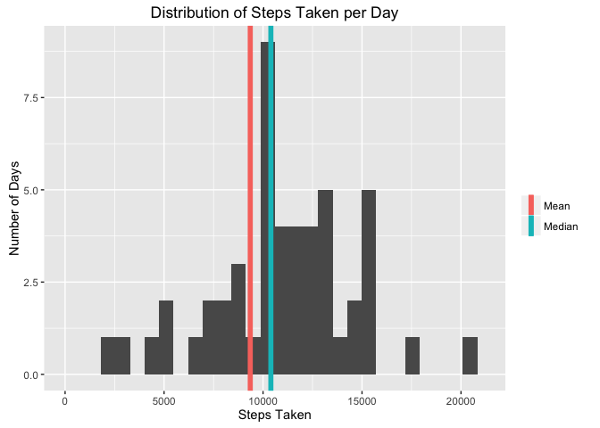

# Reproducible Research: Peer Assessment 1


## Loading and preprocessing the data

```r
library(ggplot2)
library(dplyr)
setwd("~/rwork/RepData_PeerAssessment1/")
raw_data <- read.csv('activity.csv')
raw_data$date <- as.Date(raw_data$date, format = "%Y-%m-%d")

total_steps <- group_by(raw_data, date) %>%
  summarise(total = sum(steps, na.rm = T))
```

## What is mean total number of steps taken per day?
Histogram of total number of steps taken each day (those at zero not shown)

```r
plot <- ggplot(data = total_steps, mapping = aes(total)) %>%
  + geom_histogram() %>%
  + geom_vline(aes(xintercept=median(total_steps$total, na.rm = T), colour="Median"), size=2, show.legend=T) %>%
  + geom_vline(aes(xintercept=mean(total_steps$total, na.rm = T), colour="Mean"), size=2, show.legend=T) %>%
  + xlab("Steps Taken") %>%
  + ylab("Number of Days") %>%
  + ggtitle("Distribution of Steps Taken per Day") %>%
  + labs(colour="") %>%
  + xlim(2, max(total_steps$total, na.rm = T))
plot
```

 

Mean of all steps taken

```r
mean(total_steps$total, na.rm = T)
```

```
## [1] 9354.23
```

Median of all steps taken

```r
median(total_steps$total, na.rm = T)
```

```
## [1] 10395
```

## What is the average daily activity pattern?

```r
by_interval <- group_by(raw_data, interval) %>%
  summarise(total = sum(steps, na.rm = T))

qplot(x = interval, y = total, data = by_interval, geom = "line")
```

 

Which 5-minute interval, on average across all the days in the dataset, contains the maximum number of steps?

```r
by_interval[which.max(by_interval$total),]
```

```
## Source: local data frame [1 x 2]
## 
##   interval total
##      (int) (int)
## 1      835 10927
```

## Imputing missing values

Calculate and report the total number of missing values in the dataset
(i.e. the total number of rows with NAs)

```r
na_set <- raw_data[which(is.na(raw_data$steps)),]
dim(na_set)
```

```
## [1] 2304    3
```


Devise a strategy for filling in all of the missing values in the dataset. The strategy does not need to be sophisticated. For example, you could use the mean/median for that day, or the mean for that 5-minute interval, etc.

Create a new dataset that is equal to the original dataset but with the missing data filled in.

```r
interval_avg <- group_by(raw_data, interval) %>%
  summarise(mean = mean(steps, na.rm = T))

na_set <- merge(na_set, interval_avg, by = "interval")
na_set$steps <- na_set$mean
na_set <- select(na_set, -mean)

valid_set <- raw_data[which(!is.na(raw_data$steps)),]
new_set <- rbind(na_set, valid_set)
new_set <- new_set[order(new_set$date, new_set$interval),]
```

Make a histogram of the total number of steps taken each day and calculate and report the mean and median total number of steps taken per day. Do these values differ from the estimates from the first part of the assignment? What is the impact of imputing missing data on the estimates of the total daily number of steps?
*Note that adding the imputed averages causes the mean and median to converge*

```r
total_new_steps <- group_by(new_set, date) %>%
  summarise(total = sum(steps, na.rm = T))

plot <- ggplot(data = total_new_steps, mapping = aes(total)) %>%
  + geom_histogram() %>%
  + geom_vline(aes(xintercept=median(total_new_steps$total, na.rm = T), colour="Median"), size=2, show.legend=T) %>%
  + geom_vline(aes(xintercept=mean(total_new_steps$total, na.rm = T), colour="Mean"), size=2, show.legend=T) %>%
  + xlab("Steps Taken") %>%
  + ylab("Number of Days") %>%
  + ggtitle("Distribution of Steps Taken per Day") %>%
  + labs(colour="") %>%
  + xlim(2, max(total_new_steps$total, na.rm = T))
plot
```

 

Mean of all steps taken

```r
mean(total_new_steps$total, na.rm = T)
```

```
## [1] 10766.19
```

Median of all steps taken

```r
median(total_new_steps$total, na.rm = T)
```

```
## [1] 10766.19
```

## Are there differences in activity patterns between weekdays and weekends?

Create a new factor variable in the dataset with two levels – “weekday” and “weekend” indicating whether a given date is a weekday or weekend day.

```r
new_set$isWeekday <- as.factor(ifelse(weekdays(new_set$date) %in% c("Saturday", "Sunday"), "weekend", "weekday"))
```

Make a panel plot containing a time series plot (i.e. type = "l") of the 5-minute interval (x-axis) and the average number of steps taken, averaged across all weekday days or weekend days (y-axis).

```r
grouped_by_interval <- group_by(new_set, interval, isWeekday) %>%
  summarise(total = sum(steps))

plot <- ggplot(data = grouped_by_interval,aes(x = interval, y = total)) %>%
  + geom_line() %>%
  + facet_grid(isWeekday ~ .)
plot
```

 
